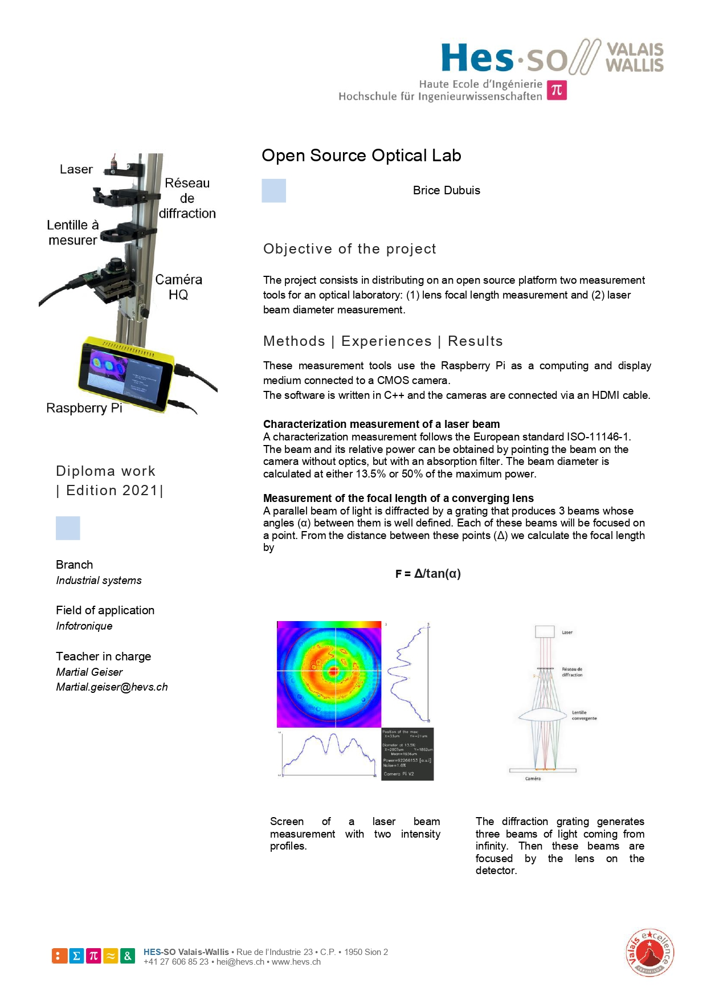

# OpenSourceOpticalLab

This repo includes two measurement tools for an optical laboratory: (1) measurement of the focal length of a lens
and (2) measurement of the diameter of a laser beam.

These measurement tools use the Raspberry Pi as a computing and display medium connected to a CMOS camera.
connected to a CMOS camera.
The software is written in C++ and the cameras are connected via an HDMI cable

Format: 
